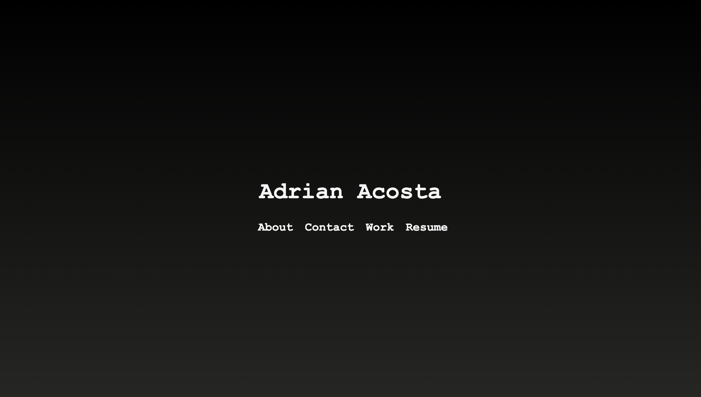
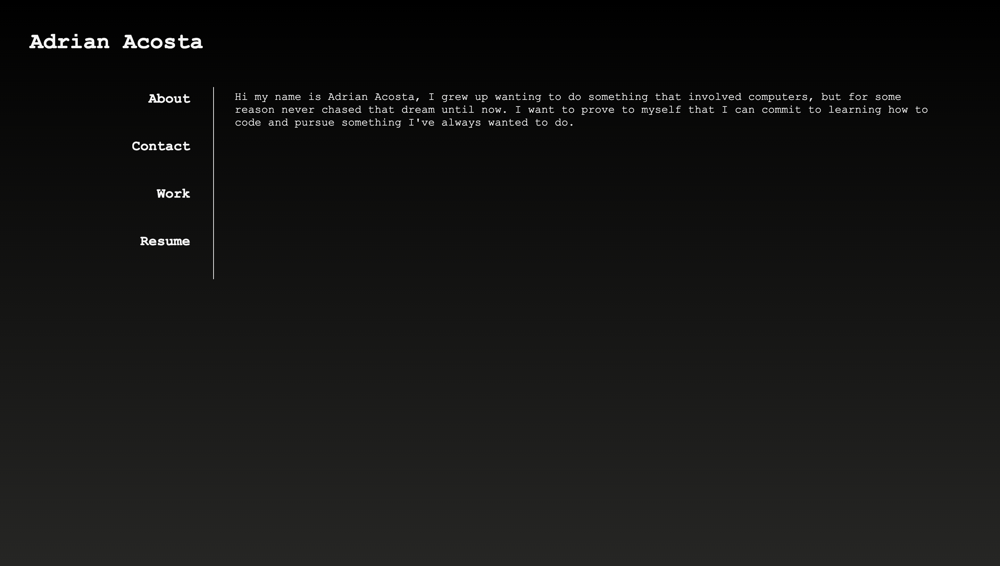
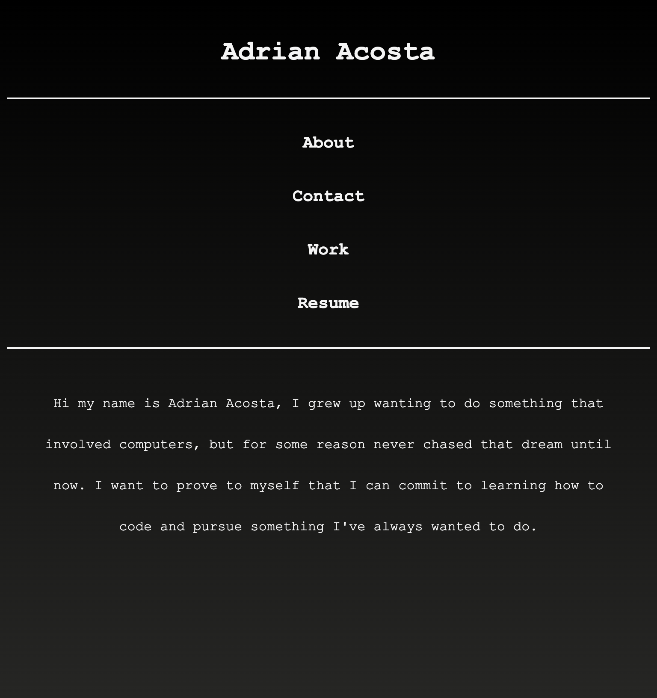

# Personal Portfolio

## <u>Description</u>

Hello, my name is Adrian Acosta and this is my professional portfolio. For anyone interested you can use this page to learn about me, contact me, view projects I've completed, and download my resume. I created this webpage with hopes of helping me connect with other developers and showcase the projects I've completed, are working on, or even plan on working on. Over time I want to keep this portfolio up to date with projects and even add onto the original code of the page itself.

## <u>Usage</u> 

### Front Page

### About Page
 

### Responsive Layout

## Visit Portfolio

[Adrian Acosta's Portfolio](https://itzbigidy.github.io/Portfolio/index.html)

---

MIT License

Copyright (c) 2023 ItzBigidy

Permission is hereby granted, free of charge, to any person obtaining a copy
of this software and associated documentation files (the "Software"), to deal
in the Software without restriction, including without limitation the rights
to use, copy, modify, merge, publish, distribute, sublicense, and/or sell
copies of the Software, and to permit persons to whom the Software is
furnished to do so, subject to the following conditions:

The above copyright notice and this permission notice shall be included in all
copies or substantial portions of the Software.

THE SOFTWARE IS PROVIDED "AS IS", WITHOUT WARRANTY OF ANY KIND, EXPRESS OR
IMPLIED, INCLUDING BUT NOT LIMITED TO THE WARRANTIES OF MERCHANTABILITY,
FITNESS FOR A PARTICULAR PURPOSE AND NONINFRINGEMENT. IN NO EVENT SHALL THE
AUTHORS OR COPYRIGHT HOLDERS BE LIABLE FOR ANY CLAIM, DAMAGES OR OTHER
LIABILITY, WHETHER IN AN ACTION OF CONTRACT, TORT OR OTHERWISE, ARISING FROM,
OUT OF OR IN CONNECTION WITH THE SOFTWARE OR THE USE OR OTHER DEALINGS IN THE
SOFTWARE.
